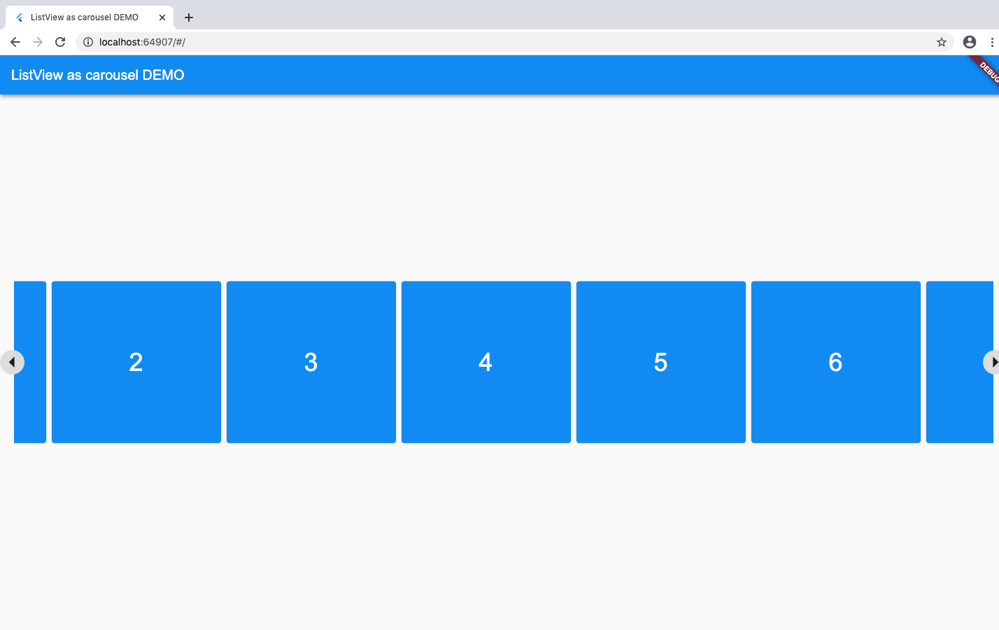

# flutter_list_pro

This new flutter package help developers to enable the carousel scroll feature for listView in web.


## Installation

Add the following to pubspec.yaml

```yaml
dependencies:
---
flutter_list_pro: ^0.0.1
```
## Usage Example

import flutter_list_pro.dart

```dart
import 'package:flutter_list_pro/flutter_list_pro.dart';
```
### code examole

```dart
   child: ScrollHandler(
              scrollController: _scrollController,
              scrollThreshold: 200,
              child: Container(
               margin: EdgeInsets.fromLTRB(10, 10, 10, 10),
                height: MediaQuery.of(context).size.height * 0.35,
                child: ListView.builder(
                    scrollDirection: Axis.horizontal,
                    controller: _scrollController,
                    itemCount: numbers.length,
                    
                    itemBuilder: (context, index) {
                      return Container(
                        padding: EdgeInsets.symmetric(horizontal: 0.0, vertical: 24.0),
                        width: 250,
                        child: Card(
                          color: Colors.blue,
                          child: Container(
                            child: Center(
                                child: Text(
                              numbers[index].toString(),
                              style: TextStyle(
                                  color: Colors.white, fontSize: 36.0),
                            )),
                          ),
                        ),
                      );
                    }),
              ))
```

#### Screenshot example




**Refer to [Git repo link ](https://github.com/moonraft-innovation-labs/flutter_list_pro) and the source code for more information.**
